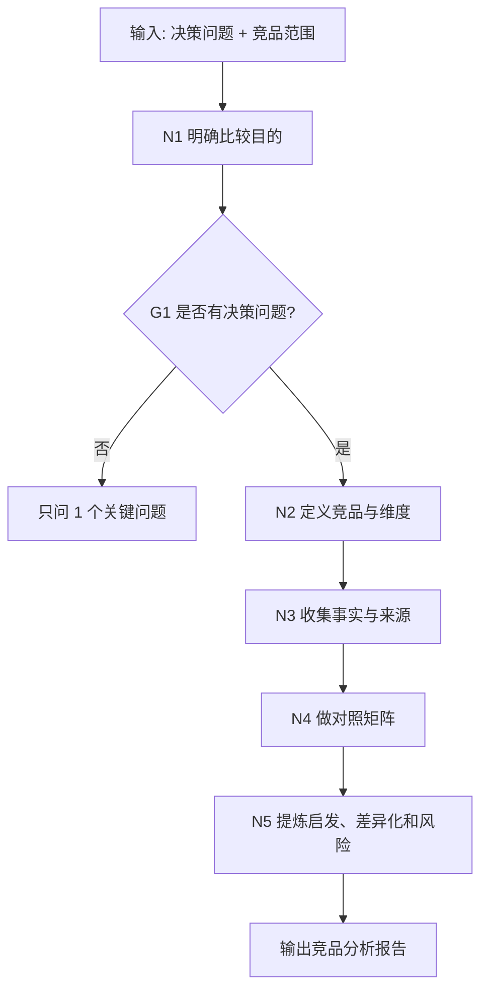

# 竞品分析报告工作流拓扑

## 1. 目标

竞品分析不是资料收集，而是为了支持产品决策。

## 2. 拓扑图

```mermaid
flowchart TD
  A["输入: 决策问题 + 竞品范围"] --> B["N1 明确比较目的"]
  B --> C{"G1 是否有决策问题?"}
  C -- 否 --> C1["只问 1 个关键问题"]
  C -- 是 --> D["N2 定义竞品与维度"]
  D --> E["N3 收集事实与来源"]
  E --> F["N4 做对照矩阵"]
  F --> G["N5 提炼启发、差异化和风险"]
  G --> H["输出竞品分析报告"]
```

## 3. 输出包

| 产物 | 作用 |
| --- | --- |
| 竞品分析报告 | 帮用户判断方向 |
| 对照矩阵 | 结构化比较竞品 |
| 启发与取舍 | 说明我们该学什么、不学什么 |
| 差异化选项 | 形成策略选择 |
